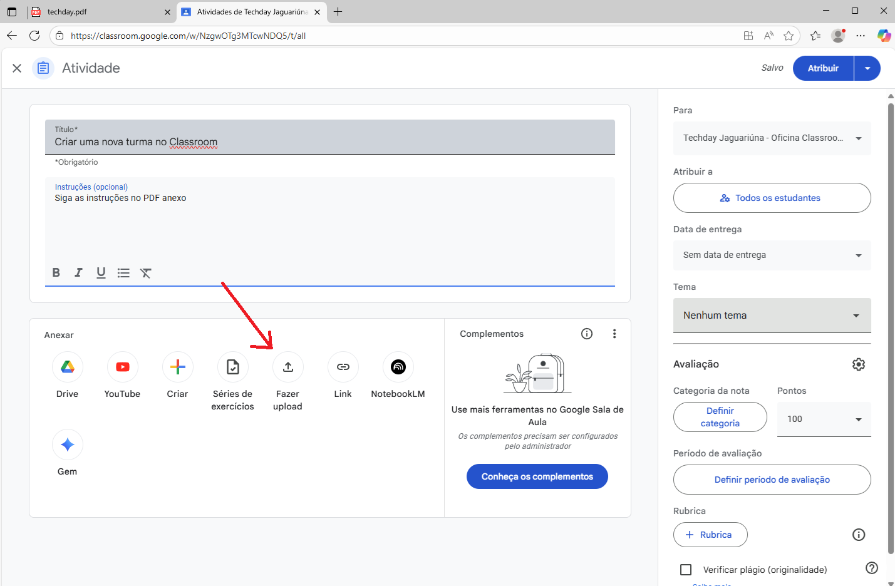
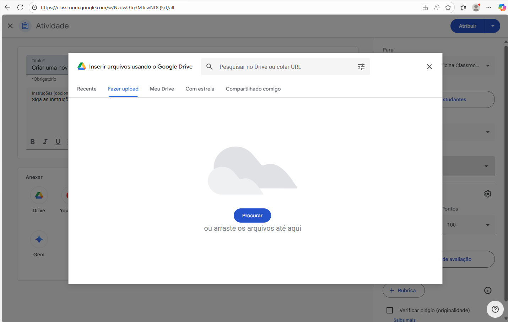

# Classroom
[classroom.google.com](https://classroom.google.com)
## Como criar uma nova turma
- 1 Acesse o [Classroom](https://classroom.google.com) de preferência com seu e-mail institucional (@docente.senai.br)
- 
- 2 Clique no botão de mais **(+)** no canto superior direito e em seguida em **criar uma turma**.
- 
- 3 Preencha os campos com as informações da turma e clique em **criar**
- 4 Acrescente os alunos pelo código da turma ou envie o convite por e-mail.
- 
## Como criar uma atividade
- 1 Acesse a turma desejada e clique na aba **Atividades**.
- 2 Clique no botão **Criar** e selecione o tipo de atividade que deseja criar.
- 
- 3 Preencha as informações da atividade e clique em **Criar**.
- 

## [Adicionar outros professores](./add_profs.md)